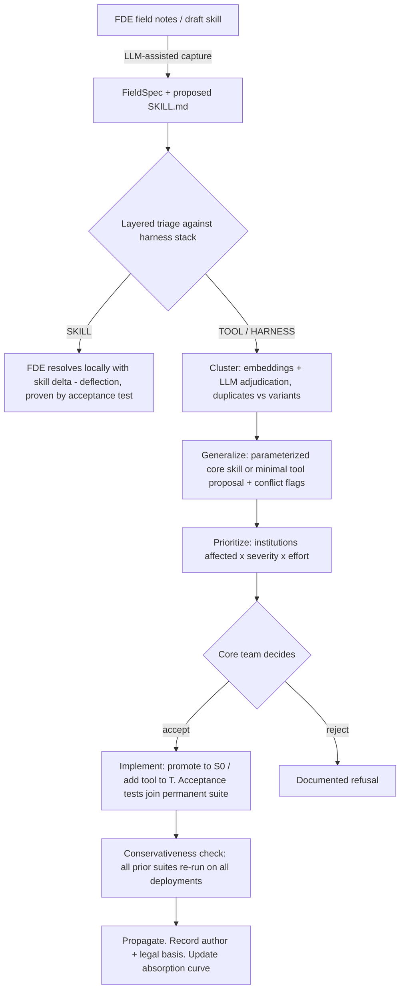

# ABSORB — A Spec-Driven Framework for Evolving a Core Product from Field Deployments

**Research plan (paper #2)** · Petru-Liviu Bouruc · August 2026 · *working title* · rev. 2
*(rev. 2: core recast as agent harness + skills; layered triage; trace-based acceptance tests.
Companion document: `Doc/harness-migration-plan.md`)*

---

## 1. Problem statement

AI platforms for institutions (public administration, healthcare, enterprise) are not shipped
shrink-wrapped: a **forward-deployed engineer (FDE)** adapts a common core to each institution's
local reality. Industry treats what FDEs learn in the field as informal signal — tickets, Slack
messages, tribal knowledge — that *may* eventually shape the product. There is no formal model of
this feedback loop, no structured artifact for carrying field knowledge back to the core team, and
no metric for whether the platform is actually *learning* from its deployments.

Our prototype (paper #1) exhibits the problem concretely: its three domain workflows required
**553 lines of Python against only 39 lines of declarative config**. Every new institution or
procedure today costs engineering time; whether that cost falls over successive deployments is
exactly the question nobody measures.

Modern **agent harnesses** (Claude Code, the Claude Agent SDK, and the emerging SKILL.md
convention) suggest the target shape of the core: an invariant agent loop, a set of typed tools,
and declarative *skills* — prose procedures loaded on demand. In that shape, the natural unit an
FDE collects in the field is **a skill**: a reviewable artifact combining the requirement, its
legal evidence, and its implementation.

**Goal:** formalize the FDE → core feedback loop as a spec-driven process — structured skill/
requirement capture, automated triage against the harness stack, duplicate/variant clustering,
generalization proposals, prioritization, governed promotion into the core — and define a
measurable notion of platform learning (the *absorption curve*).

## 2. Background and gap

| Field | What it gives us | What it lacks |
|---|---|---|
| **Software Product Lines** (FODA, variability management) | Formal core/config split; feature models | Variability is designed *upfront* by analysts, not discovered in the field |
| **CrowdRE** (crowd-based requirements engineering) | Requirement streams from many stakeholders; dedup, clustering | No model of what the product can *already express*; product is a black box |
| **Spec-driven development** (SpecKit, Kiro, LLM-era practice) | Executable specs as unit of work | Practitioner-led; essentially no academic formalization |
| **Agent harnesses & skills** (Claude Code / Agent SDK, SKILL.md convention) | Existence proof of invariant-core + declarative-extension architecture; skill libraries in the wild | No formal model of the deployment feedback loop; no maturity metric; no governance story for regulated settings |

**The gap we target is the intersection:** a stream of field requirements arriving as skills,
triaged against a *formal model of the harness stack*, with LLM assistance, under a governance
regime suitable for public administration, evaluated longitudinally.

## 3. Research questions

- **RQ1 (Model).** Can the FDE feedback loop be formalized so that requirement triage —
  "is this resolvable at the skill layer, does it need a new tool, or a harness change?" —
  becomes an operational, testable decision?
- **RQ2 (Pipeline).** How accurately can an LLM pipeline grounded in the core's harness stack
  (skill library + tool registry) triage, deduplicate, and cluster a real field-requirement
  stream, compared to expert labels and to stack-blind baselines?
- **RQ3 (Learning).** Does systematic absorption measurably reduce per-deployment engineering
  cost over a sequence of deployments — i.e., does the absorption curve rise?

## 4. Formal model

**Def. 1 (Core).** A core product is `C = (H, T, S₀)`:
- **H** — the *harness*: the invariant agent loop (model invocation, context assembly,
  progressive skill loading, tool execution, permission enforcement);
- **T** — the *tool set*: typed capabilities with **enforced semantics** (validation, case
  creation, scheduling), each carrying a permission scope and an audit obligation;
- **S₀** — the *shared skill library*: prose procedures with attached data and scripts.

*In prototype v2 (see companion migration plan): the agent loop + tool executor are `H`; document
validation, case creation, slot booking etc. are `T`; `skills/*/SKILL.md` with their checklists
are `S₀`.*

**Def. 2 (Deployment).** A deployment is `d_i = (C, S_i)` — the shared core plus
deployment-local skills `S_i` (including parameterizations of `S₀` skills).

**Def. 3 (Field requirement).** A requirement is `r = (g, e, a)`: an observed **gap** `g`,
supporting **evidence** `e` (legal basis, documents, counterexamples), and a declarative
**acceptance test** `a` asserting over API responses *and tool-call traces*. `r` is *satisfied*
in deployment `d` iff `a` passes against `d`.

**Def. 4 (Layered triage).** The triage function assigns `T(r) ∈ {SKILL, TOOL, HARNESS, REJECT}`:

| Verdict | Criterion | Consequence |
|---|---|---|
| `SKILL` | resolvable by authoring/editing prose + data at deployment level, *using existing tools* — proven by `a` passing | Resolved by the FDE ("deflected") — core team never involved |
| `TOOL` | demands **guaranteed semantics prose cannot enforce**: a validation rule, computation, or permission check whose violation matters | New typed capability in `T` — the key variability point |
| `HARNESS` | requires changing the invariant loop itself: context policy, permission model, execution type | Rare, expensive, core-team decision |
| `REJECT` | out of scope / conflicts with policy or law | Documented refusal |

*Why not expressibility?* Under a natural-language skill layer, naive expressibility collapses —
prose can "express" nearly anything the model can attempt. The operative boundary is
**enforcement**: what must be *guaranteed* versus merely *described*. We adopt the normative rule
**"prose proposes, tools dispose"**: any requirement whose violation carries legal consequence
must sit at `TOOL` or below, even if behaviorally achievable by prose. This rule is itself a
contribution: it is the auditability condition for LLM agents in regulated settings.

**Def. 5 (Duplicates vs. variants).** Two requirements are **duplicates** iff they are satisfied
by the *identical* skill delta. They are **variants** iff a *single* parameterized skill (or a
single new tool) resolves both via *different parameter values*.
*This distinction is the engine of the framework: a cluster of variants at one point is
quantitative evidence that the point deserves a parameterized skill in `S₀` or a tool in `T`.
Naive dedup conflates the two and destroys precisely this signal.*

**Def. 6 (Absorption as distillation down the stack).** An absorption step promotes recurring
field knowledge one layer down:
1. **variant clusters across deployments' `S_i`** → a parameterized shared skill promoted into `S₀`;
2. **recurring script/procedure fragments inside skills** → a typed tool added to `T`;
3. **recurring tool patterns** → a harness capability in `H`.

An absorption step is **conservative** iff every previously accepted acceptance suite still
passes on every existing deployment (verified automatically — regression, not review).

**Def. 7 (Absorption curve).** Over a requirement stream `r_1 … r_n` ordered by arrival,
`A(t)` = fraction of requirements in a sliding window with `T(r) = SKILL` *at arrival time* —
i.e., resolvable in the field without core-team involvement. A maturing platform shows rising
`A(t)`; plateaus reveal domains of irreducible bespoke work. **`A(t)` is our proposed maturity
metric for field-deployed platforms — to our knowledge, not defined or measured before.**

## 5. The spec artifact (schema)

Each FDE submission is one structured document. For `SKILL`-layer work it travels as the **YAML
frontmatter of the proposed `SKILL.md` itself** — spec and implementation in one reviewable,
diff-able artifact; for `TOOL`/`HARNESS` requests it is standalone. The acceptance test reuses
the declarative request/expect format of the prototype's `tests/tests.json`, extended with
**trace assertions** over the tool-call sequence (sourced from the audit log / OpenTelemetry —
infrastructure paper #1 already built).

```json
{
  "$schema": "https://json-schema.org/draft/2020-12/schema",
  "title": "FieldSpec",
  "type": "object",
  "required": ["id", "deployment", "gap", "evidence", "acceptance_test", "status"],
  "properties": {
    "id":         { "type": "string", "pattern": "^FS-[0-9]{4}$" },
    "date":       { "type": "string", "format": "date" },
    "author":     { "type": "string", "description": "FDE identifier" },
    "deployment": {
      "type": "object",
      "required": ["institution", "procedure"],
      "properties": {
        "institution":  { "type": "string", "description": "e.g. Primaria Cluj-Napoca" },
        "institution_class": { "enum": ["comuna", "oras", "municipiu", "sector", "national"] },
        "procedure":    { "type": "string", "description": "e.g. carte_identitate" }
      }
    },
    "gap": {
      "type": "object",
      "required": ["observed", "expected"],
      "properties": {
        "observed": { "type": "string", "description": "What the core does today" },
        "expected": { "type": "string", "description": "What the institution requires" }
      }
    },
    "evidence": {
      "type": "object",
      "properties": {
        "legal_basis": { "type": "string", "description": "e.g. HCL 123/2025, OUG 97/2005 art. 14" },
        "artifacts":   { "type": "array", "items": { "type": "string" }, "description": "URLs, scans, counterexamples" }
      }
    },
    "proposal": {
      "type": "object",
      "properties": {
        "kind":        { "enum": ["skill", "tool", "harness"], "description": "FDE's estimate — overwritten by triage" },
        "description": { "type": "string" },
        "skill_diff":  { "type": "string", "description": "If skill: path/diff of the proposed SKILL.md" }
      }
    },
    "generality": {
      "type": "object",
      "properties": {
        "estimate":  { "enum": ["local", "regional", "universal"] },
        "rationale": { "type": "string" }
      }
    },
    "severity": { "enum": ["blocking", "degraded", "cosmetic"] },
    "acceptance_test": {
      "type": "object",
      "description": "Declarative test in the prototype's tests.json format + trace assertions",
      "required": ["request", "expect"],
      "properties": {
        "request":      { "type": "object" },
        "expect":       { "type": "object" },
        "expect_trace": { "type": "array", "items": { "type": "object" },
                          "description": "Assertions over the tool-call sequence (audit/OTel), e.g. tool called, args, result" }
      }
    },
    "status": {
      "enum": ["submitted", "triaged", "clustered", "generalized",
               "accepted", "implemented", "verified", "propagated", "rejected"]
    },
    "triage":  {
      "type": "object",
      "properties": {
        "verdict":    { "enum": ["SKILL", "TOOL", "HARNESS", "REJECT"] },
        "resolution": { "type": "object", "description": "If SKILL: the skill delta that resolves it, proven by the acceptance test" }
      }
    },
    "links": {
      "type": "object",
      "properties": {
        "cluster_id":   { "type": "string" },
        "duplicates":   { "type": "array", "items": { "type": "string" } },
        "variants_of":  { "type": "array", "items": { "type": "string" } },
        "absorbed_in":  { "type": "string", "description": "Core version (S₀/T/H change) that absorbed this cluster" }
      }
    }
  }
}
```

**Example instance** (real variation: some SPCLEP offices demand proof of address no older than
30 days). Note the triage outcome: prose could *ask* citizens for a recent document, but cannot
*enforce* rejection — so this is `TOOL`, not `SKILL`: the `validate_document` tool gains a
`max_age_days` parameter, after which every future office with a different validity window
becomes a `SKILL`-layer parameterization. One absorption step, then deflection forever:

```json
{
  "id": "FS-0007",
  "deployment": { "institution": "SPCLEP Sector 3", "institution_class": "sector",
                  "procedure": "carte_identitate" },
  "gap": { "observed": "Any dovada_adresa upload is accepted regardless of issue date",
           "expected": "Office rejects proof-of-address documents older than 30 days" },
  "evidence": { "legal_basis": "Dispozitie interna DEP 45/2025",
                "artifacts": ["https://.../acte-necesare-ci"] },
  "proposal": { "kind": "tool", "description": "validate_document gains max_age_days, set per deployment" },
  "generality": { "estimate": "regional", "rationale": "Seen in 3 of 6 sector offices, different windows" },
  "severity": "blocking",
  "acceptance_test": {
    "request": { "method": "POST", "path": "/api/chat",
                 "json": { "session_id": "s_fs7", "message": "__upload__ dovada_adresa issued 2025-01-10" } },
    "expect":  { "status": 200 },
    "expect_trace": [
      { "tool": "validate_document",
        "result_contains": { "valid": false, "reason": "doc_too_old" } }
    ]
  },
  "status": "submitted",
  "triage": { "verdict": "TOOL" }
}
```

## 6. Framework pipeline



Stage summary:

1. **Capture** — freeform FDE notes → validated `FieldSpec` (+ draft skill where applicable).
2. **Triage** — LLM given the harness stack (skill index, tool registry with schemas) decides the
   layer; a `SKILL` verdict must be *proven* by producing the skill delta and passing `a`.
3. **Cluster** — embedding similarity proposes candidate groups; LLM pairwise adjudication
   separates duplicates from variants (Def. 5).
4. **Generalize** — per cluster, propose the minimal conservative promotion (parameterized `S₀`
   skill, or tool signature for `T`); flag inter-institution conflicts.
5. **Prioritize** — score = f(#deployments affected, severity, effort); ranked backlog.
6. **Decide, verify, propagate, govern** — human decision; accepted specs' tests join the
   permanent regression suite; conservativeness enforced automatically; every promotion records
   *who changed the procedure definition, when, on what legal basis* — a procedure-change audit
   trail no current skill ecosystem provides, and a hard requirement in government.

## 7. Evaluation plan

### 7.1 Test bed

**Prototype v2**: the paper-#1 prototype migrated to the harness + skills architecture per
`Doc/harness-migration-plan.md`. Its skill library and tool registry are `(S₀, T)`; its
`tests/run_json_tests.py` runner (extended with trace assertions over the audit log) executes
acceptance tests. The migration itself yields the motivating before/after numbers
(LoC-per-domain under v1 vs. v2).

### 7.2 Ground-truth dataset (the key asset)

Romanian public institutions **publish their real procedural variation**: different city halls and
SPCLEP offices list different required documents, validity windows, fees, and steps for the same
legally-uniform procedures. We collect procedure pages from **N = 15–30 institutions** (mix of
comune/orașe/municipii/sectoare), diff each against the baseline skills/checklists, and encode
every diff as a `FieldSpec`. This yields a *real* requirement stream with known duplicates, known
variants, and known triage labels — far stronger than synthetic/LLM-persona streams.

Two annotators independently label triage layer and cluster membership; we report **Cohen's κ**
and adjudicate disagreements. The dataset and labels are released as an open artifact.

### 7.3 Experiments and metrics

| Exp. | Question | Metric | Baselines / ablations |
|---|---|---|---|
| **E1** Triage | Is stack-grounded triage accurate? | Precision/recall/F1 per class (SKILL/TOOL/HARNESS) vs. gold | (a) same LLM *without* the skill index + tool registry in context; (b) keyword rules |
| **E2** Clustering | Are duplicates/variants correctly grouped? | ARI, B-Cubed F1 vs. gold clusters | (a) embedding-threshold only; (b) LLM-only; (c) no duplicate/variant distinction |
| **E3** Generalization | Are proposed promotions correct? | **Coverage**: % cluster members whose acceptance tests (incl. trace assertions) pass under the generated skill/tool; **Conservativeness**: 0 regressions on prior suites (hard requirement); **Minimality**: artifact-size delta + expert rating | Human-written promotion as reference |
| **E4** Absorption curve | Does the platform learn? | `A(t)` over bootstrap-resampled stream orders; deflection rate; lines-of-prose vs. lines-of-code per requirement over time | Static-core counterfactual (no absorption) |
| **E5** Prioritization *(optional)* | Is the ranking sane? | Kendall's τ / NDCG vs. expert ranking (3–5 raters) | Frequency-only ranking |

### 7.4 Success criteria (what "good" means, stated upfront)

- **E1:** triage macro-F1 ≥ 0.80, and stack-grounding beats the stack-blind ablation by a
  statistically significant margin (the core claim of RQ2 — the *formal model does work*).
- **E2:** ARI ≥ 0.70; the duplicate/variant distinction measurably improves generalization inputs.
- **E3:** conservativeness violations = 0 (enforced, not aspired to); coverage ≥ 90%.
- **E4:** `A(t)` rises monotonically (within CI bands) on the real stream and clearly separates
  from the static-core counterfactual — this answers RQ3.
- **Enforcement audit** (new, ties to Def. 4's normative rule): for every gold requirement labeled
  legally-consequential, the pipeline never triages it `SKILL` — target violation rate 0.
- LLM nondeterminism: fixed temperature, ≥ 3 runs, report mean ± sd for every LLM-dependent metric.

### 7.5 Threats to validity

- **Single domain** (Romanian public administration): the model (Defs. 1–7) is domain-agnostic,
  and §2's harness row gives an independent existence proof of the pattern (commercial harnesses
  absorbed field variability into CLAUDE.md/skills/MCP exactly along Def. 6's trajectory);
  mitigate further with a small second-procedure-family replication if time allows.
- **Vendor coupling:** the harness is defined abstractly (Def. 1) and implemented minimally
  in-repo; the SKILL.md format follows the open convention, portable across harnesses.
- **Ground truth from public pages** may lag institutional practice: evidence field records
  source and date; findings framed accordingly.
- **Annotator bias:** two independent annotators, κ reported, disagreements adjudicated.
- **LLM data contamination:** procedure pages are post-cutoff scrapes; prompts contain the stack,
  not the labels.

## 8. Work plan

| Phase | Duration | Deliverable |
|---|---|---|
| **P1** Formalization & schema | 2 wks | Defs. 1–7 tightened; `FieldSpec` JSON Schema; example specs |
| **P2** Prototype v2 migration | 3–4 wks | Harness + skills architecture per `Doc/harness-migration-plan.md`; before/after LoC numbers |
| **P3** Dataset | 3–4 wks *(parallel with P2)* | 15–30 institutions scraped, diffed, double-annotated (κ) |
| **P4** Pipeline | 4–5 wks | `specs/` module: capture, layered triage, clustering, generalization, backlog, governance log |
| **P5** Experiments | 3–4 wks | E1–E4 (+E5 if time); absorption curve on real data |
| **P6** Writing | 4 wks | Paper draft + open artifact (dataset, labels, pipeline, prototype v2) |

Total ≈ 5–6 months.

## 9. Expected contributions

1. **A formal model** of the FDE feedback loop over an agent-harness core: harness/tools/skills
   stack, layered triage by *enforcement* rather than expressibility, the duplicate-vs-variant
   distinction, and absorption as conservative distillation down the stack (Defs. 1–7).
2. **The "prose proposes, tools dispose" rule** as an auditability condition for LLM agents in
   regulated settings, with an enforcement-audit metric.
3. **The `FieldSpec`/skill artifact** — spec and implementation unified in one reviewable
   document with *executable, trace-based* acceptance criteria, under a governance regime that
   records author and legal basis for every procedure change.
4. **An LLM pipeline** for stack-grounded triage, dedup/variant clustering, and generalization
   proposals — with ablations isolating the value of grounding in the formal stack.
5. **The absorption curve `A(t)`** as a measurable maturity metric for field-deployed platforms.
6. **An open dataset** of real procedural variation across Romanian public institutions, with
   expert triage/cluster labels, plus the pipeline and prototype v2 as reusable artifacts.

## 10. Venue candidates

- **RE** (IEEE Int. Requirements Engineering Conf.) — natural fit for the framework contribution.
- **ICSA / ECSA** — if framed around architecture/variability; the harness-stack model fits.
- **EGOV / dg.o** — application-side companion framing, ties to the PhD topic; the governance
  contribution (procedure-change audit trail) leads here.
- Journal option: **REJ** (Requirements Engineering Journal) or **JSS** extended version.

---

*Prepared with the paper-#1 prototype (this repository) as reference implementation.
Architecture migration detailed in `Doc/harness-migration-plan.md`.*
