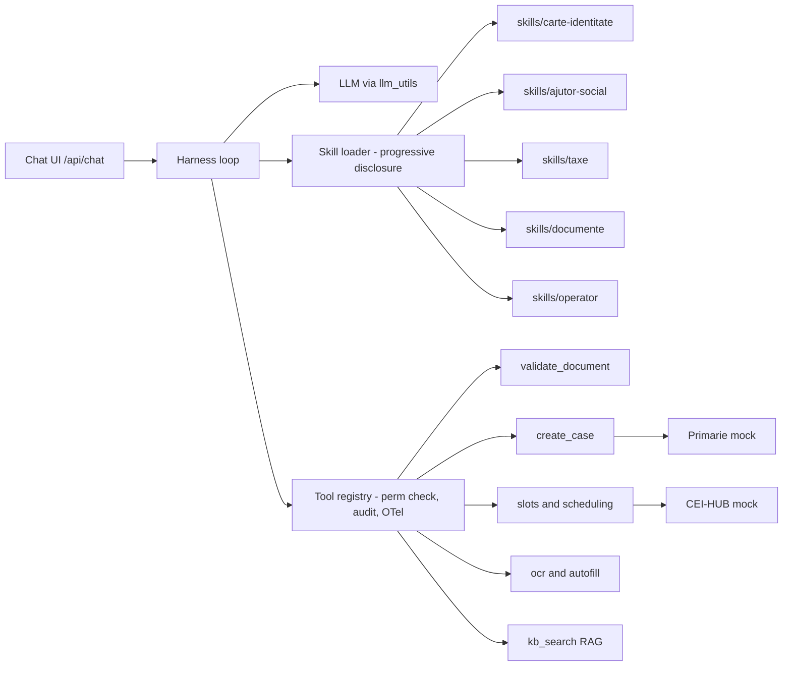

# Migration Plan: Multi-Agent Graph → Agent Harness + Skills (Prototype v2)

**Companion to** `Doc/absorption-framework-plan.md` · August 2026 · *plan only — implementation later*

---

## 1. Goal and guiding principles

Replace the hand-rolled multi-agent architecture (`agents/graph.py` A2A loop + per-domain agent
classes) with a **single main agent on a minimal harness**, where each domain becomes a
**skill** (SKILL.md + attached data) and every consequential action becomes a **typed tool**.

Principles, in priority order:

1. **Prose proposes, tools dispose.** Legally-relevant gates — eligibility, required-document
   validation, case creation, fees, permissions — live in the tool layer as code. A skill may
   *describe* a procedure; it must not be able to *waive* a check by omission. The audit log
   records tool calls, which are the legally-relevant actions.
2. **Tests stay green throughout.** v1 and v2 run side by side behind a flag; the existing
   `tests/tests.json` suite is the migration's safety net.
3. **Minimal, inspectable harness.** ~200–300 LoC in-repo, model-agnostic via the existing
   `agents/llm_utils.py`. No vendor SDK dependency in the core (research control + no lock-in);
   SKILL.md follows the open convention so skills remain portable to commercial harnesses.
4. **Everything outside the agent loop is untouched.** FastAPI shell, templates/JS, both mock
   services, `services/auth.py`, `audit.py`, `observability.py`, `db.py` stay as they are.

## 2. Target architecture



| v1 component | v2 fate |
|---|---|
| `agents/graph.py` (A2A loop) | Replaced by `agents/harness.py` loop |
| `agents/router_agent.py` + `agents/routing_keywords.py` | **Deleted.** Skill `description` frontmatter is the routing surface; the harness's skill index replaces keyword routing |
| `agents/entry_agent.py` | Base system prompt (greeting, language selection RO/EN) |
| `agents/ci_agent.py`, `social_agent.py`, `taxe_agent.py` | `skills/*/SKILL.md` + existing `checklists/*.json` as attached resources; step gates move into tools |
| `agents/doc_intake_agent.py`, `doc_ocr_agent.py` | Tools (`classify_document`, `ocr_extract`, `propose_autofill`, `apply_autofill`) + guidance in `skills/documente` |
| `agents/scheduling_agent.py` | Tools (`list_slots`, `reserve_slot`, `reschedule`, `cancel`) + guidance inside domain skills |
| `agents/operator_agent.py` | `skills/operator` + operator-scoped tools; `assert_actor_perm` enforcement moves wholly into the tool layer |
| `agents/case_agent.py`, `case_registry.py` | Tools (`create_case`, `get_case`, `advance_case_status`) |
| `agents/orchestrator.py` | Kept as the API surface; `/api/chat` dispatches to v1 graph or v2 harness by flag |
| `agents/history.py` (HistoryStore) | Reused as-is for session transcripts |
| `HubGovAgent.py`, `LegalGov.py` | Folded into tools (`hub_*`) and `kb_search`; stubs deleted |

## 3. The skill format

`skills/<name>/SKILL.md`, following the open convention: YAML frontmatter + markdown body,
loaded progressively (index always visible; body loaded on demand).

```markdown
---
name: carte-identitate
description: Eliberarea/reinnoirea cartii de identitate (CEI/CIS/VR) — eligibilitate,
  acte necesare, programare, taxe. Trigger: buletin, carte de identitate, CI expirat.
language: ro
resources:
  - checklists/ci.json          # required docs per type/eligibility (tool-read, not prose)
  - kb/procedure.json#ci        # fees, legal notes
tools_used: [get_checklist, validate_document, list_slots, reserve_slot, create_case, get_fees]
# --- FieldSpec provenance (for FDE-authored/modified skills) ---
fieldspec:
  id: FS-0000
  evidence: { legal_basis: "OUG 97/2005" }
---

# Procedura: Carte de identitate

## Pasii conversatiei
1. Stabileste tipul solicitarii (prima eliberare / expirare / pierdere / schimbare nume-adresa)...
2. Cere documentele din checklist (obtinut cu `get_checklist`) — NU enumera din memorie...
3. Dupa fiecare upload, starea documentului vine din `validate_document`...
4. Programarea CEI merge prin HUB (list_slots service=hub)...
...
```

Rules:
- The checklist JSON is read by **tools** (`get_checklist`, `create_case`), never restated as
  prose truth — the skill tells the agent *to call the tool*, not what the answer is.
- FDE-authored or FDE-modified skills carry `fieldspec:` provenance in frontmatter (gap,
  evidence/legal basis, acceptance-test id) — this is the paper's spec-as-skill artifact.
- Bilingual: `language: ro` primary, EN fallback handled by base prompt.

## 4. Tool inventory (v2 `agents/toolkit.py`)

Every tool: JSON-schema signature → `assert_actor_perm(scope)` → execute → `write_audit()` →
OTel span. Sources: current `agents/tools.py`, `case_registry.py`, service endpoints.

| Tool | Scope | Enforced semantics (the part prose cannot waive) |
|---|---|---|
| `get_checklist(procedure, applicant)` | citizen | Deterministic doc list from `checklists/*.json` incl. eligibility extras (AGE_14, LOSS, CHANGE_ADDR…) |
| `validate_document(kind, file_ref)` | citizen | MIME/size checks (exists today); **`max_age_days` per deployment (FS-0007 example)** |
| `classify_document(file_ref)` | citizen | Doc-kind recognition (filename/OCR heuristics from `doc_intake_agent`) |
| `ocr_extract(file_ref)` | citizen | EasyOCR + `services/ocr_utils.py` entity extraction, returns fields + confidence |
| `propose_autofill(fields)` / `apply_autofill(proposal_id, confirmed)` | citizen | Apply **requires explicit user confirmation** — the current router gate becomes a tool precondition |
| `list_slots(service, …)` / `reserve_slot` / `reschedule` / `cancel` | citizen | CEI→HUB vs CIS/local routing rule; slot validity |
| `get_fees(procedure, type)` | citizen | Fee table from `kb/procedure.json` |
| `kb_search(query)` | citizen | RAG over `kb/` with citations (`agents/rag.py`) |
| `create_case(program, person, docs)` | citizen | **Refuses unless checklist satisfied** — the central "tools dispose" gate |
| `get_case(case_id)` | citizen* | Own-case check for citizens |
| `advance_case_status(case_id, status)` | operator | Status-transition allowlist (from `operator_agent`) |
| `hitl_claim(task_id)` / `hitl_complete(task_id, result)` | operator | Task ownership rules |

The registry is a decorator (`@tool(scope="citizen")`) collecting name, JSON schema, scope —
it doubles as the machine-readable `T` that the ABSORB triage pipeline receives as context.

## 5. Harness design (`agents/harness.py`)

Minimal loop, deliberately boring:

1. **Context assembly:** base system prompt (persona, RO/EN policy, "always act through tools")
   + **skill index** (every skill's `name` + `description` — a few hundred tokens) + schemas of
   scope-permitted tools + session transcript from `HistoryStore`.
2. **Skill loading:** built-in tool `load_skill(name)` injects the SKILL.md body into context.
   The model decides when — this replaces `router_agent` entirely. At most N skills loaded per
   session; loading is audited (routing decisions become observable trace events).
3. **Tool execution:** parse tool calls → permission check → execute → audit + span → feed
   result back. Unknown tool / denied scope returns a structured error to the model, never an
   exception to the user.
4. **Termination:** reply with no tool calls, or hard cap (e.g. 8 tool rounds/turn) → halted
   flag, mirroring v1's `halted`.
5. **Config:** temperature 0, model + caps via env (`HARNESS_MODEL`, `HARNESS_MAX_ROUNDS`).

Explicitly rejected alternative: building v2 on a commercial agent SDK. Reason: the paper needs
a fully-inspectable `H` (Def. 1) and vendor neutrality (§7.5 of the research plan); the SKILL.md
convention keeps the skills portable anyway. Revisit for a deployment track, not for research.

## 6. Compatibility and feature flag

- `AGENT_MODE=v1|v2` (env). `orchestrator.py` `/api/chat` dispatches accordingly; both share
  `HistoryStore`, DB, mocks. Default stays `v1` until Phase 6 exit criteria pass.
- Response contract `{reply, state, halted}` is preserved. v2 fills `state` with
  `{language, loaded_skills, current_skill, case_ids}` so existing UI keeps working; tests that
  assert `state.current_domain` get a compatibility mapping (`current_skill → current_domain`).

## 7. Migration phases

| Phase | Work | Exit criterion |
|---|---|---|
| **M0** Baseline | Extend `tests/run_json_tests.py` with `expect_trace` assertions read from the audit log; record v1 pass rate + per-domain LoC (the "before" numbers) | Runner supports trace assertions; v1 suite green |
| **M1** Harness core | `harness.py` (loop, skill index, `load_skill`) + `toolkit.py` (registry, perm/audit/span wrapper); `AGENT_MODE` flag in orchestrator | Harness answers a trivial chat with zero skills; audit rows + spans emitted |
| **M2** Tool extraction | Implement the §4 inventory by wrapping existing code (`tools.py`, `case_registry.py`, service calls); unit-test the enforced gates directly (esp. `create_case` refusal, `apply_autofill` confirmation) | Gate unit tests pass; tools callable standalone |
| **M3** First vertical slice | `skills/carte-identitate` + `skills/documente`; run the CI-domain subset of tests.json against v2 | CI-domain tests pass on v2 (with compat mapping); side-by-side transcript review v1 vs v2 |
| **M4** Remaining domains | `skills/ajutor-social`, `skills/taxe`; scheduling guidance folded into domain skills | Social + taxe tests pass on v2 |
| **M5** Operator flows | `skills/operator` + operator-scoped tools; port T-series role/permission tests, **including the prompt-injection test** — the security property must now be carried entirely by tool-layer scopes | All role-based and injection tests pass on v2 |
| **M6** Cutover & cleanup | Default `AGENT_MODE=v2`; delete `graph.py`, `router_agent.py`, `routing_keywords.py`, domain agent classes, stubs; convert remaining state-based assertions to trace-based | Full suite green on v2; v1 code removed; "after" LoC recorded |

Estimated effort: M0–M2 ≈ 1.5 wks, M3 ≈ 1 wk, M4–M5 ≈ 1 wk, M6 ≈ 0.5 wk → **~4 wks**, matching
P2 in the research plan.

## 8. Test strategy

- **Unit (new):** enforced tool gates tested directly, no LLM in the loop — these are the
  auditability claims, they must not depend on model behavior.
- **Behavioral (converted):** tests.json scenarios assert on responses + `expect_trace`
  (tool-call sequence from audit log). Trace assertions are order-tolerant by default
  (`contains`, not `equals`) to absorb benign plan variation.
- **Determinism:** temperature 0; each behavioral test run 3× in CI-style loop; a test passes
  iff 3/3 (flaky = failing).
- **Parity gate:** M6 requires v2 ≥ v1 on the full suite; any intentional behavior change gets
  its tests.json entry updated in the same commit, never silently.

## 9. Metrics to capture (paper numbers)

Record at M0 (before) and M6 (after):

| Metric | Purpose |
|---|---|
| LoC per domain: Python vs. prose+JSON | The headline cost-structure shift (v1: 553 vs 39) |
| Marginal cost of a new domain (measure by adding a 4th, e.g. `certificat_urbanism`, post-M6) | Direct evidence for the absorption thesis |
| Tokens/turn, latency/turn, tool rounds/turn | Honest cost accounting of the tradeoff |
| Test pass parity table (v1 vs v2, per scenario) | Migration validity |
| Enforcement audit: 0 legally-consequential checks reachable only via prose | The Def. 4 normative rule, verified |

## 10. Risks and mitigations

| Risk | Mitigation |
|---|---|
| Nondeterministic wizard flow (v1 gates were code) | Gates are tools with preconditions — the flow may vary, the *guarantees* cannot; temperature 0; trace-based tests |
| Prompt injection now targets a more capable agent | Security property carried by tool scopes + `assert_actor_perm`, never by prose; injection test ported and extended in M5 |
| Cost/latency per turn rises vs. keyword routing | Skill index keeps context small; cap tool rounds; optionally a cheap-model pre-turn for trivial messages (only if measurements demand it) |
| RO diacritics / bilingual drift in skills | Language policy in base prompt; skills authored in RO; T-series language tests kept |
| Regression during migration | `AGENT_MODE` flag, v1 stays default until M6 parity gate |
| Over-fitting skills to the current mocks | Skills reference tools, not mock internals; mocks untouched by design |

## 11. Results (measured after migration, branch `harness-based`)

### 11.1 Test outcomes

| Suite | v1 (before) | v2 (after) |
|---|---|---|
| `tests/tests.json` (25 behavioural scenarios) | **0 / 25** | **25 / 25** |
| `tests/test_tool_gates.py` (enforcement gates, no LLM) | did not exist | **17 / 17** |

The v1 baseline of 0/25 is not a migration artefact. The suite was written against
an intended contract the v1 code never implemented, and v1 additionally crashed on
the main chat path (`graph.py:59` — an agent returned `None`, so `state.get` failed).
Three further defects surfaced while establishing the baseline and were fixed:

- `agents/tools.py` imported `sympy` (a stray IDE auto-import) — this alone prevented
  the application from starting at all;
- the suite shared one HTTP client across tests, so a session from an earlier test
  leaked into later tests that assume an anonymous caller (`tests/run_json_tests.py`
  now clears cookies per test);
- `/health`, the JSON login/logout flow, and the JSON operator-task API described by
  the tests did not exist and were implemented in `main.py`.

**The M0 exit criterion in §7 ("v1 suite green") was therefore unachievable as
written and should be read as "baseline recorded", not "baseline passing".**

### 11.2 Cost structure

| Metric | v1 | v2 |
|---|---|---|
| Domain/agent Python | 1511 LoC | 0 (superseded) |
| Invariant core (domain-agnostic) | — | 1021 LoC (`harness.py` 412 + `toolkit.py` 609) |
| Procedure definitions | Python classes | 300 lines of prose across 7 skills |
| Declarative config | 96 lines JSON | 121 lines JSON |
| Routing | 76 LoC (`routing_keywords.py`) + 194 LoC (`router_agent.py`) | `triggers:` in skill frontmatter (0 LoC) |

The invariant core is now roughly constant in the number of domains, whereas v1 grew
by 77–342 LoC of Python per domain.

### 11.3 Marginal cost of a new domain

A fourth domain (`certificat-urbanism`) was added after cutover as a direct
measurement: **51 lines of configuration (41-line `SKILL.md` + 10-line checklist
JSON) and zero lines of Python.** It routes, resolves its checklist, and is served by
the same core.

One honest qualification, which is itself evidence for the framework's thesis: the
first attempt at this domain did *not* cost zero Python. `tool_docs_required()` in
`agents/tools.py` branched explicitly on `ci`/`social`/`taxe`, so an unknown
procedure resolved to an empty checklist. Generalising that into a config-driven
resolver (`toolkit.required_docs()`, which loads `checklists/<procedure>.json` and
supports both checklist shapes) was a one-time **absorption step** in the sense of
Def. 6 — after it, the procedure list is derived from the filesystem
(`known_procedures()`) and every subsequent domain is config-only. The residual
variability point was discovered exactly the way the ABSORB framework predicts:
by attempting the next deployment.

### 11.4 Enforcement audit

`tests/test_tool_gates.py` verifies, without any LLM in the loop, that prose cannot
waive: `create_case` refuses an incomplete file or missing person fields;
`validate_document` enforces the per-deployment validity window (FS-0007);
`advance_case` rejects statuses outside the allowlist; all five operator tools deny a
citizen actor; operator tools are not even visible to citizens; and an unknown tool
returns structured data rather than raising.

### 11.5 Deviations from the plan

- **v1 was retained** behind `AGENT_MODE=v1` rather than deleted at M6. It is the
  paper-#1 artefact and the static-core counterfactual for experiment E4; the flag
  makes keeping it free. Deletion remains a one-commit operation.
- **Deterministic mode added.** The harness runs without an LLM when `LLM_USE` is
  unset or no API key is present: skills are selected by their declared `triggers`
  and answered via their declared `fallback_tool`. This was not in the plan but is
  required for the suite to run in CI, and it keeps routing keywords in
  configuration rather than moving them back into code.
- **`/api/chat` now returns `state`** (`current_domain`, `current_skill`,
  `last_agent`, `loaded_skills`, `case_ids`, `mode`, `tool_calls`). The `tool_calls`
  trace is the substrate for the trace-based assertions in §8; converting the
  existing state-based assertions to trace-based remains open.

## 12. Non-goals

- No production deployment, no real-institution data.
- No changes to mocks, auth model, UI templates, or DB schema (beyond audit-log read access for
  the test runner).
- No vendor-SDK adoption in the research core (see §5 decision note).
- The ABSORB pipeline itself (`specs/` module) is **not** part of this migration — it lands in
  research-plan phase P4, consuming the registry and skill library this migration produces.
