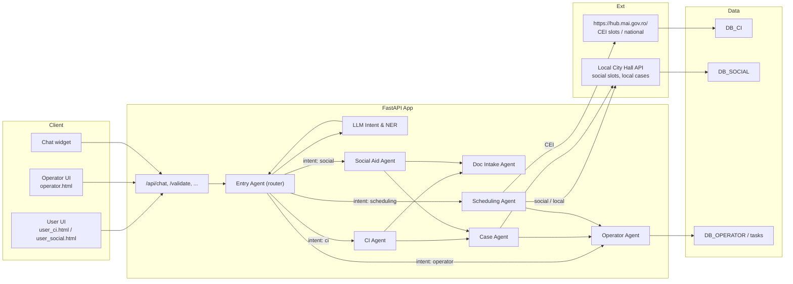

## Current state
# 1. Current State vs. Agentic AI

**Current system is semi-agentic already:**

- `orchestrator.py` decides which branch to follow based on user text.  
- `tools.py` wraps external actions (local API, hub, OCR, payments).  
- The UI consumes **steps** (small structured outputs).

# 2. Agents (Modular Breakdown)

## 1) Entry Agent (Intent Router)

**Input:** user text, session  
**Output:** { next_agent: "ci" | "social" | "operator" | "intake" | "scheduling" | ... }  
**Function:** Detect intent (via regex or LLM classification) and route.

**Routes to:**
- CI Agent (identity card)
- Social Aid Agent
- Operator Agent
- Document Intake Agent (if talking about uploading)
- Scheduling Agent (if talking about appointments)

---

## 2) CI Agent

**Scope:** Handles the identity card use-case.  
**Calls:** tool_eligibility, tool_docs_missing  
**Behavior:**
- Collects required documents; flags missing items.
- Once complete, delegates to:
  - Case Agent (open the case/file)
  - Scheduling Agent (if CEI type)
- Note: Can reuse existing logic from orchestrator.py.

---

## 3) Social Aid Agent

**Scope:** Handles “ajutor social” / “venit minim de incluziune”.  
**Behavior:**
- Collects the same personal info as CI.
- Uses a different document checklist (from JSON or RAG).
- Scheduling via local slots (not HUB).
- Delegates to Case Agent after data collection.

---

## 4) Document Intake Agent (OCR Agent)

**Scope:** Processes uploaded documents.  
**Flow:**
- Scans uploads via /local/uploads?session_id=...
- Extracts recognized types (e.g., cert_nastere, dovada_adresa).
- Updates application state:
    app["docs"] = recognized_docs
- Triggered by user statements like “I uploaded my files” or “ready”.

---

## 5) Scheduling Agent

**Sources:**
- CEI: queries /hub/slots
- Social Aid: queries /local/slots-social

**Behavior:**
- Shows available times to the user.
- On command `schedule slot <id>`, reserves the appointment.

---

## 6) Case Agent

**Scope:** Case creation and lifecycle hooks.  
**Actions:**
- Creates the case record (POST /local/cases).
- Optionally triggers payment/signature steps.
- Stores case ID and status in memory/state.

---

## 7) Operator Agent

**Scope:** Back-office operator commands.

**Examples:**
- list tasks
- claim task 5
- done task 5 notes: verified
- list cases
- advance case CASE-123 to READY_FOR_PICKUP

**Note:** This logic already exists in the bottom section of orchestrator.py.



# TODO:

1. Enable LLM classification in Entry Agent for better intent detection.
2. Go deeper in each agent’s logic (e.g., CI Agent’s document checklist from RAG).
3. Start for 2 with doc_intake_agent.py and scheduling_agent.py. which are obvious
4. Other cases for deeper LLM agents:
    - users write “Vreau buletin pentru fiu” → regex might miss, LLM maps to ci
    - users write “am nevoie de ajutorul acela social de la primarie, stii tu” → LLM still maps to social
    - LLM can extract slot id even if user writes “ia-l pe al doilea” (you can prompt it to resolve ordinals)
    - We can do few-shot prompting: give 2–3 examples from your flows and improve accuracy.


## Reuse for Future Use-Cases

We orchestrate agents with a **LangChain Graph**; the current nodes are implemented in `Agents/graph.py`.  
The workflow below shows how to add more use-cases without changing the core.

### Add a new use-case (e.g., “unemployment aid”, “school subsidy”)

1. **Create a new agent**
   - File: `Agents/unemployment_agent.py`
   - Responsibilities: its own checklist + flow (eligibility, docs, next steps).

2. **Register the node in the LangChain graph**
   - File: `Agents/graph.py`
   - Add a node and edges (routing from `entry_agent` and to downstream agents like `case_agent`, `scheduling_agent`).

3. **Extend intent routing**
   - File: `Agents/entry_agent.py`
   - Add **one line** to detect the new intent and return `next_agent="unemployment"`.

4. **(Optional) Wire service endpoints**
   - If needed, add an endpoint for local slots or case type (e.g., `/local/slots-unemployment`, `/local/cases?type=UNEMPLOYMENT`).

---

**E.g., `Agents/entry_agent.py` (intent detection)**
```python
if match_intent(text, ["somaj", "unemployment", "ajutor somaj"]):
    return {"next_agent": "unemployment"}
```

### `Agents/graph.py` (LangChain graph registration)
```python
graph.add_node("unemployment", unemployment_agent)           # new node
graph.add_edge("entry", "unemployment")                      # route from entry
graph.add_edge("unemployment", "doc_intake")                 # collect docs
graph.add_edge("unemployment", "case")                       # open case
graph.add_edge("unemployment", "scheduling")                 # if appointment needed
```

###


# Tehnical Spec: CI Chatbot State & Intents

### State per session (`SESS_STATE`)
- `phase`: `idle | await_docs | await_slot | done`
- `person`
- `app`
- `missing`

---

### Intents handled (regex-ish)

- **start CI**: “carte de identitate”, “ci noua”, “create new ci”
- **docs Q&A**: “ce documente/ce acte/what documents”
- **mark doc present**: “am [certificat de nastere | ci veche | dovada adresa]”
- **done uploading**: “gata”, “am incarcat”, “ready”
- **show slots**: “arata sloturi”, “show slots”
- **schedule by slot id**: “programeaza slot 123…”, “schedule 123…”

---

### Revalidate after uploads
If the frontend calls `/api/chat` again with the structured `person` + `application`, we recompute `missing`. (This is how `/user-ci` can hand control back to the chat, if you want.)

---

### Uploads/edits nudge
Always nudge to `/user-ci?sid=…` for uploads/edits.  
The chat page will render the link as a clickable button (you already added linkify).


# MCP CEI/CIS/CIP – Full Demo  
**RAG + MCP-style tools + HITL + Auth + SQLite + Single/Multi process run modes**

This repository is a minimal end-to-end demo for streamlining the Romanian ID (CI) flow:

- **Chatbot** that orchestrates steps via **MCP-like tools** (eligibility, documents, case, payment, signature, scheduling, notifications).  
- **Operator dashboard** (human-in-the-loop) with **task queue**, **reschedule/cancel**, and **status transitions**.  
- **Persistence** using SQLite (SQLModel).  
- **Auth** for operator (cookie-based JWT).  
- **File upload** + **thumbnails** + **mock OCR**.  
- **RAG** over JSON/DOCX (uses OpenAI embeddings if key provided; otherwise a local fallback).

> The demo is intentionally simple and local-friendly. Replace parts with your production stack as needed.

---

## Quick start

```bash
python -m venv .venv && . .venv/bin/activate      # Windows: .venv\Scripts\activate
pip install -r requirements.txt
```

Create a local `.env` (optional but recommended). See **Environment** below.

---

## Run modes (choose via env)

You can run everything in **one process** (mounting the two mock services under the main app) or in **three processes** (classic split). Control this with `RUN_MODE`.

### 1) Single process (mounted) — recommended for development
```bash
export RUN_MODE=mounted
# (optional) export $(cat .env | xargs)   # if you keep vars in .env
uvicorn main:app --reload --port 8000
```

- Chat UI: `http://localhost:8000/`  
- Operator UI: `http://localhost:8000/operator`  
- CEI-HUB mock (mounted): `http://localhost:8000/hub/...`  
- Primarie mock (mounted): `http://localhost:8000/local/...`

### 2) Split processes (classic)
```bash
export RUN_MODE=split
uvicorn services.cei_hub_mock:app --reload --port 8001 &
uvicorn services.primarie_local_mock:app --reload --port 8002 &
uvicorn main:app --reload --port 8000
```

- CEI-HUB: `http://localhost:8001/...`  
- Primarie: `http://localhost:8002/...`  
- Main app: `http://localhost:8000/`

> In **mounted** mode, defaults for `HUB_URL` and `LOCAL_URL` are `http://localhost:8000/hub` and `http://localhost:8000/local`.  
> In **split** mode, defaults switch to `http://localhost:8001` and `http://localhost:8002`.  
> You can always override with explicit `HUB_URL` / `LOCAL_URL` in your environment.

---

## Environment

Copy `.env.example` to `.env` and adjust as needed:

```bash
# Decide how services run
RUN_MODE=mounted        # or: split

# Optional explicit overrides (normally not needed in mounted mode)
# HUB_URL=http://localhost:8000/hub
# LOCAL_URL=http://localhost:8000/local

# OpenAI (optional; enables real embeddings for RAG)
# OPENAI_API_KEY=sk-...
# OPENAI_MODEL=gpt-4o-mini
# OPENAI_EMB_MODEL=text-embedding-3-small

# RAG inputs
RAG_KB_DIR=kb
# RAG_DOCX_PATH=/absolute/path/to/procedura.docx

# Upload constraints
MAX_UPLOAD_MB=10

# Auth (demo only — change in production)
AUTH_SECRET=please_change_me
```

---

## What’s included

- **Chatbot** (`/api/chat`): runs the full flow → eligibility → docs → case → payment → signature → scheduling → notifications.  
- **Reschedule/Cancel** (`/api/reschedule`, `/api/cancel`): CEI appointment management.  
- **RAG search** (`/api/search`): quick retrieval endpoint (debug/testing).  
- **Operator UI** (`/operator`): list cases, change status (state machine), manage HITL tasks, reschedule/cancel.  
- **Upload** (`/upload`): PDF/JPG/PNG validation, thumbnail generation (for images), OCR mock forwarding.

---

## Directory structure

```text
├── main.py                     # FastAPI app: chat UI, operator UI, upload, auth flows, /api router
├── auth.py                     # JWT cookie auth (demo user in-memory)
├── db.py                       # SQLModel models + init
├── agents/
│   ├── orchestrator.py         # Chat endpoint + MCP-like tool orchestration + reschedule/cancel + RAG search
│   ├── rag.py                  # RAG over kb/*.json and optional DOCX, with OpenAI embeddings or fallback
│   └── tools.py                # Tools (eligibility/docs/case/payment/sign/schedule/notify/ocr)
├── services/
│   ├── cei_hub_mock.py         # Mock CEI-HUB: slots + appointments (reschedule/cancel), persisted
│   └── primarie_local_mock.py  # Mock Primarie: cases/pay/sign/uploads/webhooks/tasks, persisted
├── templates/
│   ├── chat.html               # Chat playground (user)
│   ├── operator.html           # Operator dashboard (HITL)
│   └── login.html              # Operator authentication page
├── static/
│   └── uploads/thumbs/         # Thumbnails saved here
├── kb/
│   └── procedure.json          # Example KB; extend with your data
├── requirements.txt
├── .env.example
└── README.md
```

---

## Notes & tips

- **RAG:** If `OPENAI_API_KEY` is present, the RAG layer uses OpenAI embeddings; otherwise a local heuristic runs (lower quality but fine for dev).  
- **Security:** Demo only — replace in-memory users with a real IdP and rotate `AUTH_SECRET`.  
- **Data:** SQLite file is `mcp_demo.db` in the repo root. Delete it to reset state.  
- **HITL:** The backend auto-creates a `DOC_REVIEW` task when a case is created. Use the operator UI to claim/complete.  
- **Rescheduling:** CEI slots are auto-seeded for the next 7 days at 09:00 and 14:00.

---

## Troubleshooting

- **401 on /operator**: you need to log in first (`operator@example.com` / `demo1234`).  
- **No slots visible**: restart the app; seeding runs at service startup.  
- **Uploads rejected**: only `image/jpeg`, `image/png`, and `application/pdf` are allowed; max size is `MAX_UPLOAD_MB`.  
- **RAG not returning good answers**: set `OPENAI_API_KEY` and optionally `RAG_DOCX_PATH` to your official procedure DOCX.

---

Happy hacking!
